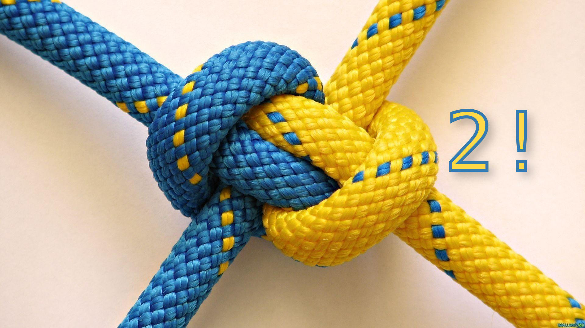

= Optimiser son intégration continue de projet Python (mais pas que) - mardi 17 mars 2026

.Rediffusion vidéo : https://www.youtube.com/watch?v=KKBBOGeRPJg (merci Alex !)

== Actualités

**Anthony Ricaud** : link:2026.03.17-ci-actualités-quoi_de_noeuf.pdf[2026.03.17-ci-actualités-quoi_de_noeuf.pdf] en 2 parties dans la soirée :

* https://www.youtube.com/watch?v=KKBBOGeRPJg&list=PLv7xGPH0RMUT1GSCGHJmqnswpk-nyz5aq[partie 1]
* https://www.youtube.com/watch?v=KKBBOGeRPJg&list=PLv7xGPH0RMUT1GSCGHJmqnswpk-nyz5aq&t=3555s[partie 2]

== Présentations

Présentations et personnes intervenantes :

* **Luc Sorel-Giffo** : https://www.youtube.com/watch?v=KKBBOGeRPJg&list=PLv7xGPH0RMUT1GSCGHJmqnswpk-nyz5aq&t=578s[Automatiser une release avec Github actions : montée de version, publication sur PyPI] (diaporama : https://github.com/lucsorel/conferences/blob/main/python-rennes-2026.03.17-ci-cd-projets-python-2/2026.03.17-ci-cd-projets-python-2.adoc[2026.03.17-ci-cd-projets-python-2.adoc], https://github.com/lucsorel/conferences/blob/main/python-rennes-2026.03.17-ci-cd-projets-python-2/2026.03.17-ci-cd-projets-python-2.pdf[version pdf], link:2026.03.17-Luc_Sorel-Giffo-ci-cd-projets-python-2[copie locale du pdf])

* **Nicolas Ledez** : https://www.youtube.com/watch?v=KKBBOGeRPJg&list=PLv7xGPH0RMUT1GSCGHJmqnswpk-nyz5aq&t=4666s[Comment l’IA va vous aider à réduire votre impact carbone] (pas de copie locale du diaporama)
