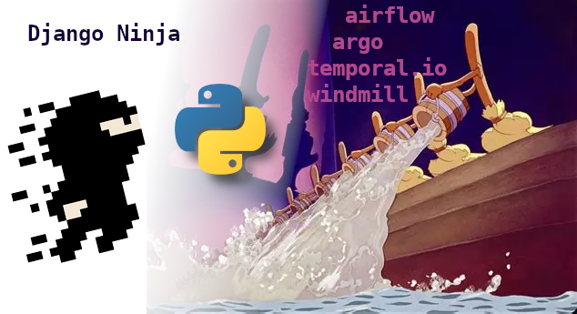

= Retours d'expérience de frameworks web et d'orchestration de workflows - lundi 27 avril 2026

.Rediffusion vidéo : https://www.youtube.com/watch?v=FhUBmdUDe-w (merci Alex !)

== Actualités

Par **Michel Caradec** : link:2026.04.27-quoi_de_noeuf-actualités.pdf[2026.04.27-quoi_de_noeuf-actualités.pdf] (source : https://github.com/lucsorel/python-for-the-muggle-born-developer/blob/main/quoi-de-noeuf-python/2022.04.07.md)

== Présentations
Présentations et personnes intervenantes :

* **Quentin Caron** : "Django Ninja : votre API nette et sans bavure ?" (diaporama : link:2026.04.27-Quentin_Caron-Django_ninja.pdf[2026.04.27-Quentin_Caron-Django_ninja.pdf])

* **Jesshuan Diné** : "Comparaison de 4 orchestrateurs de workflows open-source" (diaporama : link:2026.04.27-Jesshuan_Diné-Benchmark_orchestrateurs_de_workflows.pdf[2026.04.27-Jesshuan_Diné-Benchmark_orchestrateurs_de_workflows.pdf])
